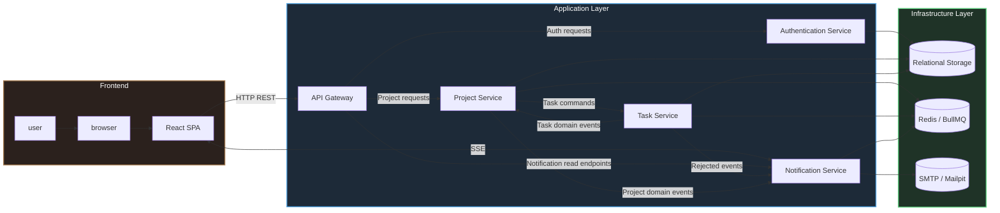
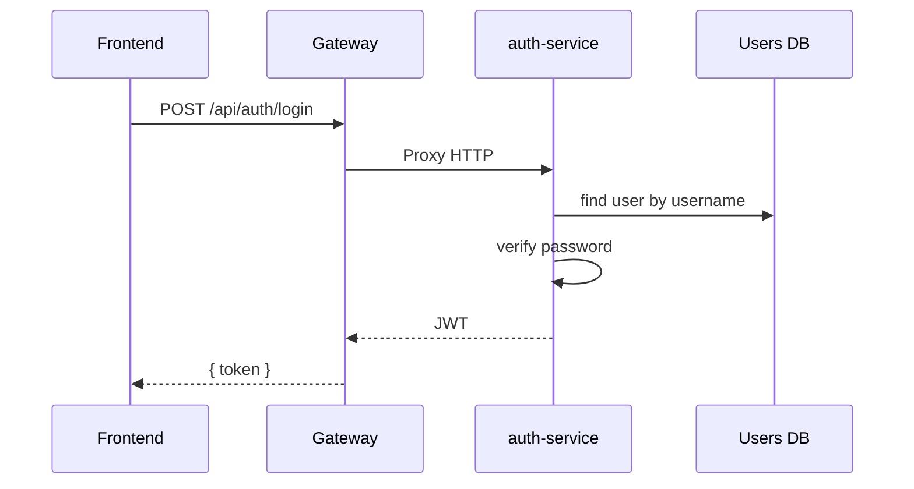
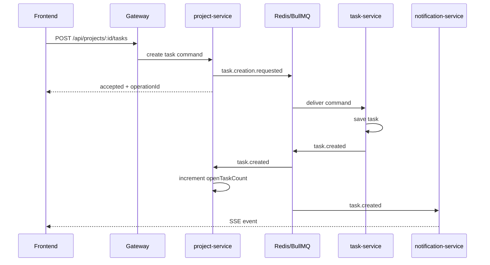

# Architecture du projet

## 1. Vue d'ensemble

Le projet est un système distribué éducatif de gestion de projets et de tâches. Il combine :

- une API HTTP synchrone pour les opérations utilisateur de base ;
- des commandes et événements asynchrones pour le cycle de vie des tâches ;
- SSE pour pousser les notifications vers le frontend ;
- plusieurs stratégies de persistance ;
- deux modes d'exploitation : local et Docker Compose.

L'objectif principal de l'architecture n'est pas de maximiser le throughput, mais de montrer une séparation claire des responsabilités entre contextes métier, transports et infrastructure.

## 2. Schéma de haut niveau

## 3. Principes architecturaux

| Principe                        | Comment il est appliqué dans le projet                                                            |
| ------------------------------- | ------------------------------------------------------------------------------------------------- |
| Séparation par contextes métier | l'authentification, les projets, les tâches et les notifications vivent dans des services séparés |
| Point d'entrée public unique    | le frontend ne dialogue pas directement avec les microservices, il passe par `gateway`            |
| Communication mixte             | HTTP est utilisé pour les requêtes synchrones, BullMQ pour les workflows asynchrones              |
| Persistance via interfaces      | l'application dépend d'abstractions de repository, pas du moteur SQL concret                      |
| Réactivité côté UI              | le frontend reçoit les changements de tâches et les notifications via SSE                         |
| Évolutivité pédagogique         | le projet supporte `memory`, `sqlite`, `mysql`, ce qui facilite les tests et l'exploitation       |

## 4. Composants et rôle de chacun

### 4.1 `gateway`

Responsable de :

- exposer l'API HTTP publique ;
- valider et décoder le JWT ;
- proxifier les routes vers les services internes ;
- exposer le endpoint SSE côté client.

`gateway` ne contient pas de logique métier forte. Il sert de couche d'accès et d'orchestration légère.

### 4.2 `auth-service`

Responsable de :

- enregistrer un utilisateur ;
- authentifier un utilisateur ;
- gérer les opérations CRUD sur le profil utilisateur ;
- stocker les utilisateurs et les hashes de mots de passe.

### 4.3 `project-service`

Responsable de :

- créer, lister, clôturer et supprimer les projets ;
- construire la vue agrégée `project details` ;
- compter les tâches ouvertes par projet ;
- publier des commandes liées aux tâches ;
- réagir aux événements provenant de `task-service`.

### 4.4 `task-service`

Responsable de :

- traiter les commandes de création, suppression et changement d'état des tâches ;
- persister les tâches ;
- émettre les faits métier finaux (`task.created`, `task.closed`, etc.).

### 4.5 `notification-service`

Responsable de :

- consommer les événements d'intégration ;
- générer des notifications temps réel ;
- pousser des événements SSE vers le navigateur ;
- envoyer des e-mails via SMTP/Mailpit.

### 4.6 `client`

Responsable de :

- gérer la session utilisateur ;
- afficher projets, tâches et notifications ;
- piloter les requêtes HTTP ;
- maintenir l'abonnement SSE ;
- stocker localement l'historique des notifications et leur état de lecture.

## 5. Flux principaux

### 5.1 Connexion utilisateur

### 5.2 Création d'une tâche

### 5.3 Changement d'état d'une tâche

Le flux est similaire : `project-service` publie une commande `task.status.toggle.requested`, `task-service` détermine le nouvel état et émet ensuite soit `task.closed`, soit `task.reopened`. `project-service` met à jour le compteur de tâches ouvertes, et `notification-service` pousse la notification au frontend.

## 6. Services, transports et interactions

| Source               | Destination                     | Transport                 | But                                        |
| -------------------- | ------------------------------- | ------------------------- | ------------------------------------------ |
| Frontend             | Gateway                         | HTTP                      | appels API publics                         |
| Frontend             | Gateway -> Notification Service | SSE                       | flux de notifications                      |
| Gateway              | auth-service                    | HTTP                      | auth et gestion des utilisateurs           |
| Gateway              | project-service                 | HTTP                      | gestion des projets et commandes de tâches |
| project-service      | task-service                    | BullMQ                    | commandes asynchrones sur les tâches       |
| task-service         | project-service                 | BullMQ                    | événements métier sur les tâches           |
| task-service         | notification-service            | BullMQ                    | événements de notification                 |
| notification-service | SMTP                            | SMTP                      | envoi d'e-mails                            |
| auth/project/task    | MySQL / SQLite / Memory         | repository + SQL / memory | persistance                                |

## 7. Frontière des bounded contexts

### `auth-service`

Possède son propre modèle utilisateur et ne connaît ni la logique des projets, ni celle des tâches.

### `project-service`

Possède le modèle de projet, les règles de clôture d'un projet et la projection locale `openTaskCount`.

### `task-service`

Possède le modèle de tâche et l'automate de statut de la tâche.

### `notification-service`

Possède les règles de diffusion des notifications, mais ne contrôle pas l'état métier des projets ou des tâches.

Cette séparation réduit le couplage du code et rend plus explicite la propriété de la logique métier.

## 8. Modes d'exécution

### Local

- backend lancé comme processus Node.js ;
- frontend lancé par Vite ;
- l'infrastructure (`mysql`, `redis`, `mailpit`) peut être démarrée via Docker.

### Docker Compose

- tous les services, y compris le frontend, s'exécutent dans des conteneurs ;
- Nginx sert le frontend et proxifie le trafic vers le backend.

## 9. Explication des choix d'architecture clés

### 9.1 Séparation entre commandes et faits dans les événements

Les commandes (`task.creation.requested`) décrivent l'intention de changer l'état, tandis que les faits (`task.created`, `task.closed`) décrivent des changements déjà réalisés. Cela permet :

- à `project-service` de demander une opération sans implémenter lui-même toute la logique de tâche ;
- à `task-service` de rester la source d'autorité pour le cycle de vie des tâches ;
- à `notification-service` de réagir à des faits métier déjà finalisés.

La conséquence est une cohérence éventuelle, mais le découplage entre services s'améliore.

### 9.3 Utilisation de SSE pour les notifications

SSE a été choisi parce que :

- le projet a surtout besoin d'un flux serveur vers client ;
- le navigateur n'a pas besoin d'un protocole bidirectionnel complet ;
- côté frontend, l'abonnement est simple à maintenir ;
- pour un scénario éducatif, cela réduit la complexité par rapport à WebSocket.

## 10. Limitation principale de l'architecture actuelle

L'architecture actuelle est orientée vers un scénario d'apprentissage et de démonstration. Elle montre correctement la séparation des responsabilités, mais certaines parties ne sont pas encore prêtes pour un environnement de production complet :

- une partie des interactions repose sur la cohérence éventuelle ;
- les notifications sont en partie stockées dans le navigateur ;
- le hub SSE est en mémoire dans le `notification-service` ;
- la sécurité est volontairement simplifiée pour garder le code lisible.
