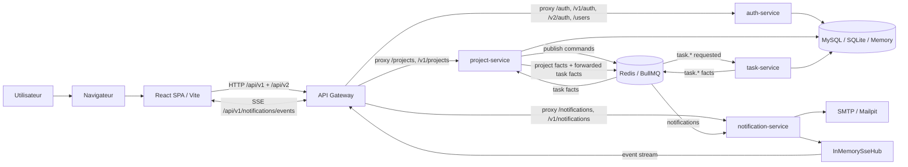
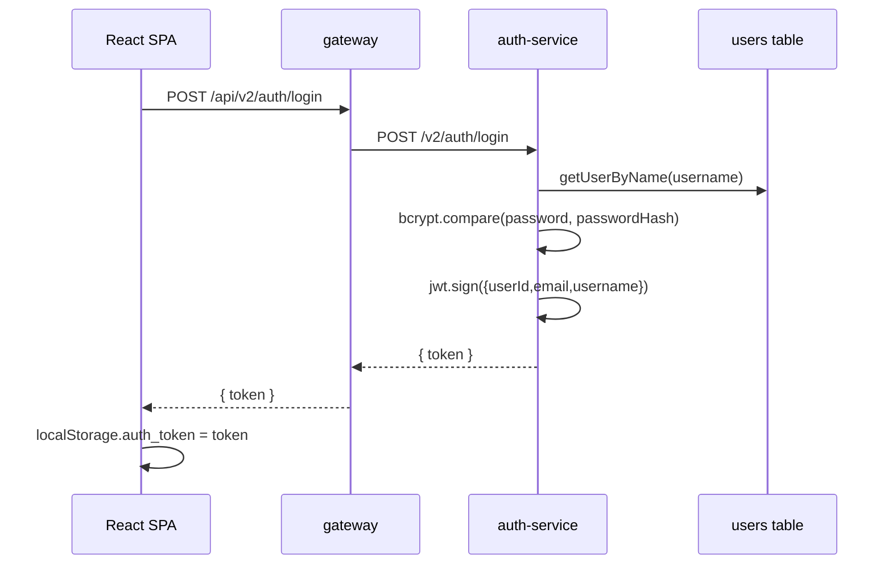
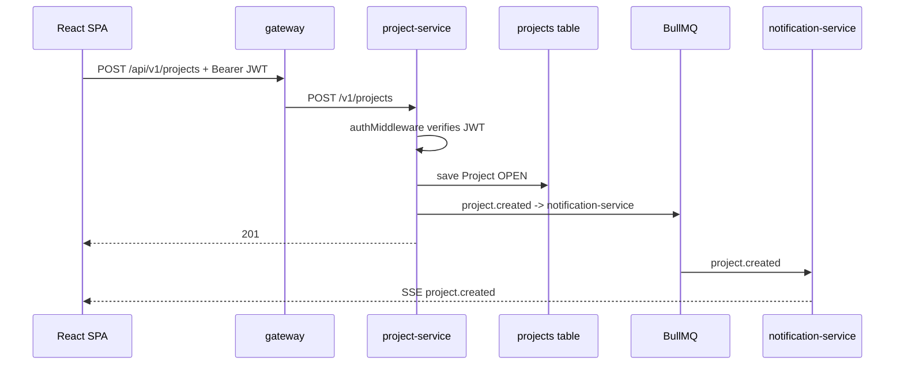
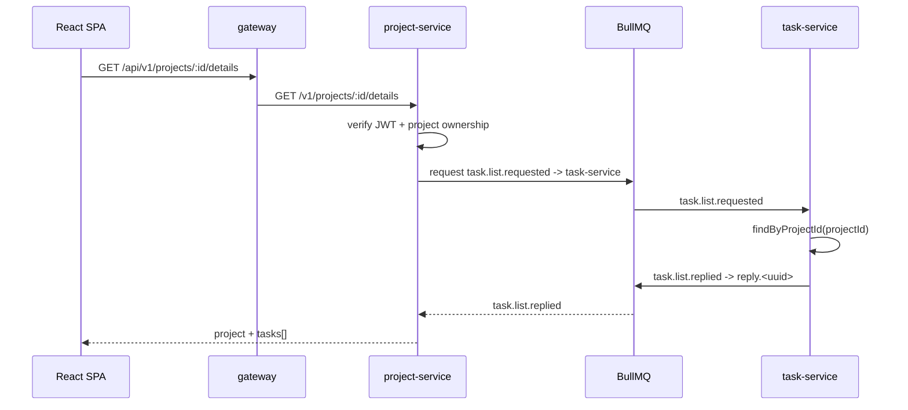
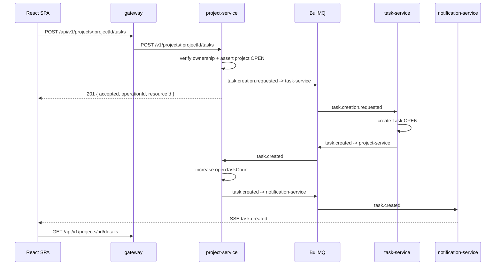

# Architecture du projet

## 1. Vue d'ensemble

Le projet est une application distribuée de gestion de projets et de tâches. Il combine une SPA React/Vite, plusieurs services Node.js/Express, Redis/BullMQ pour les échanges asynchrones, MySQL ou SQLite pour la persistance, Mailpit/SMTP pour les e-mails de développement et SSE pour les notifications en temps réel.

L'objectif principal est pédagogique: montrer une séparation claire entre contextes métier, couches applicatives, contrats d'intégration et infrastructure. Le projet n'est pas encore durci comme une plateforme de production complète; les limites actuelles sont documentées dans [Problèmes connus](known-issues.md).

## 2. Schéma de haut niveau



## 3. Monorepo et composants

Le dépôt est organisé autour de deux espaces principaux:

| Zone                               | Rôle                                                                         |
| ---------------------------------- | ---------------------------------------------------------------------------- |
| `client`                           | SPA React, API clients Axios, hooks métier, pages, composants UI, Playwright |
| `server`                           | workspaces npm backend: `common` et `apps/*`                                 |
| `server/common`                    | contrats partagés, middleware JWT, bus BullMQ, erreurs communes              |
| `server/apps/gateway`              | proxy HTTP public exposé sur `GATEWAY_PORT`                                  |
| `server/apps/auth-service`         | service utilisateur et authentification                                      |
| `server/apps/project-service`      | service projet et commandes de tâches                                        |
| `server/apps/task-service`         | service tâche, handlers d'événements et lecture des tâches par projet        |
| `server/apps/notification-service` | notifications SSE et e-mails                                                 |
| `docs/ADR`                         | décisions d'architecture historiques et complémentaires                      |
| `docs/technical`                   | documentation technique maintenue                                            |

Le backend utilise les npm workspaces. Chaque service possède son `package.json`, son `tsconfig.json`, son `Dockerfile` et ses tests. Le package `@app/common` est partagé par les services qui ont besoin des contrats, du bus ou du middleware d'authentification.

## 4. Principes structurants

| Principe                    | Application concrète                                                                                                                                                                           |
| --------------------------- | ---------------------------------------------------------------------------------------------------------------------------------------------------------------------------------------------- |
| Bounded contexts            | utilisateurs, projets, tâches et notifications sont séparés en services                                                                                                                        |
| API publique unique         | le frontend appelle `gateway` via `/api`, puis `gateway` proxifie vers les services internes                                                                                                   |
| Authentification distribuée | `authMiddleware` est appliqué dans `auth-service` pour `/users`, `/v1/users`, `/v2/users` et dans `project-service` pour `/projects`, `/v1/projects`; `gateway` ne vérifie pas lui-même le JWT |
| Communication mixte         | HTTP pour les interactions utilisateur synchrones; BullMQ pour les commandes, événements et request/reply                                                                                      |
| Persistance par interface   | les couches application dépendent de repositories, pas directement de MySQL, SQLite ou de la mémoire                                                                                           |
| Cohérence éventuelle        | les opérations de tâches sont acceptées par HTTP puis finalisées via événements                                                                                                                |
| Notifications temps réel    | `notification-service` transforme les événements métier en événements SSE consommés par le navigateur                                                                                          |
| Architecture en couches     | domaine -> application -> infrastructure, avec des règles contrôlées par dependency-cruiser côté backend                                                                                       |

## 5. Couches backend

Les services métier suivent une structure proche:

```text
src/
  domain/          Entités, value objects, interfaces de repository
  application/     Use cases, handlers d'événements, publication de messages
  infrastructure/  HTTP, messaging, persistence drivers, adaptateurs externes
  app.ts           Assemblage Express et dépendances
  index.ts         Chargement env, création container, listen/stop
```

Les règles attendues sont:

- la couche `domain` ne dépend pas de `application` ni de `infrastructure`;
- la couche `application` ne dépend pas de `infrastructure`;
- le `gateway` ne doit pas importer les internals des autres services;
- les tests ne doivent pas importer directement `mysql2` ou `sqlite3`;
- les dépendances circulaires sont signalées.

Ces contraintes sont définies dans `server/.dependency-cruiser.cjs` et peuvent être vérifiées avec:

```bash
cd server
npm run validate:architecture
```

## 6. Responsabilités des services

### `gateway`

`gateway` est le point d'entrée HTTP public du backend. Il reçoit les routes legacy `/api/auth`, `/api/users`, `/api/projects`, `/api/notifications` et les routes versionnées supportées, puis les proxifie vers les services internes configurés par variables d'environnement.

Points importants:

- il utilise `http-proxy-middleware`;
- il ne contient pas de logique métier;
- il ne valide pas le JWT lui-même;
- il ne proxifie pas directement vers `task-service`;
- il expose `/api/v1/auth`, `/api/v1/users`, `/api/v1/projects`, `/api/v1/notifications`, ainsi que `/api/v2/auth` et `/api/v2/users`;
- il renvoie `404` si aucune route `/api/*` ne correspond.

### `auth-service`

`auth-service` gère:

- l'inscription;
- le login;
- l'émission de JWT;
- la lecture et la modification du profil;
- le hachage bcrypt des mots de passe;
- la table `users`.

Les routes `/auth/*` sont publiques. Les routes `/users/*` sont protégées par `authMiddleware`.

### `project-service`

`project-service` possède le modèle `Project`:

- création, liste, détail, clôture et suppression des projets;
- validation de la propriété du projet;
- interdiction de clôturer un projet tant que `openTaskCount > 0`;
- maintien de la projection `openTaskCount`;
- publication de commandes de tâches vers `task-service`;
- consommation des événements de tâches;
- publication d'événements de projet et de notifications.

Toutes les routes `/projects/*` sont protégées par `authMiddleware`.

### `task-service`

`task-service` est la source de vérité pour les tâches. Il ne fournit pas de routes HTTP métier publiques dans l'état actuel; son API métier passe par BullMQ.

Il gère:

- création de tâches;
- changement de statut `OPEN` <-> `DONE`;
- suppression de tâches;
- lecture des tâches d'un projet via request/reply BullMQ;
- émission des événements finaux `task.created`, `task.closed`, `task.reopened`, `task.deleted`;
- émission d'événements `*.rejected` en cas d'échec d'une commande.

### `notification-service`

`notification-service` consomme les événements d'intégration et les transforme en:

- événements SSE par utilisateur;
- e-mails SMTP pour certains événements;
- notifications d'échec d'opération asynchrone.

Le service garde les connexions SSE dans `InMemorySseHub`. L'historique des notifications est maintenu côté navigateur.

### `client`

Le client React gère:

- l'inscription et le login;
- le stockage du JWT dans `localStorage`;
- l'ajout automatique de `Authorization: Bearer <jwt>` aux appels Axios;
- les pages `/projects`, `/projects/:projectId`, `/profile` et `/auth`;
- la connexion SSE avec `EventSource`;
- les notifications locales et leur compteur non lu.

## 7. Communications synchrones

### HTTP public

Le navigateur appelle toujours le préfixe `/api`.

| Route frontend            | Service cible          | Route interne      | Usage actuel |
| ------------------------- | ---------------------- | ------------------ | ------------ |
| `/api/auth/*`             | `auth-service`         | `/auth/*`          | legacy v1    |
| `/api/users/*`            | `auth-service`         | `/users/*`         | legacy v1    |
| `/api/projects/*`         | `project-service`      | `/projects/*`      | legacy       |
| `/api/notifications/*`    | `notification-service` | `/notifications/*` | legacy       |
| `/api/v1/auth/*`          | `auth-service`         | `/v1/auth/*`       | auth v1      |
| `/api/v1/users/*`         | `auth-service`         | `/v1/users/*`      | users v1     |
| `/api/v1/projects/*`      | `project-service`      | `/v1/projects/*`   | client       |
| `/api/v1/notifications/*` | `notification-service` | `/notifications/*` | client SSE   |
| `/api/v2/auth/*`          | `auth-service`         | `/v2/auth/*`       | client auth  |
| `/api/v2/users/*`         | `auth-service`         | `/v2/users/*`      | client users |

En local avec Vite, `client/vite.config.ts` proxifie `/api/v1`, `/api/v2`, `/api/auth`, `/api/users`, `/api/projects` et `/api/notifications` vers `http://localhost:3000`.

En Docker, Nginx sert la SPA et proxifie `/api/` vers `gateway:3000`.

Le client construit deux clients Axios:

- `apiClient`: `${VITE_API_URL}/v1` pour projets, tâches et notifications;
- `authApiClient`: `${VITE_API_URL}/${VITE_API_VERSION}` pour auth et users.

### Health checks

Les services métier exposent:

```http
GET /health
```

Les ports par défaut sont:

| Service                | Port local |
| ---------------------- | ---------: |
| `auth-service`         |     `3001` |
| `project-service`      |     `3002` |
| `task-service`         |     `3003` |
| `notification-service` |     `3004` |

Le `gateway` écoute sur `3000`, mais n'expose pas de route `/health` dédiée dans l'état actuel.

En mode test, les ports backend sont `3100` à `3104`.

## 8. Communications asynchrones

Le bus est défini par `server/common/messaging/MessageBus.ts` et implémenté avec BullMQ dans `bullmq.module.ts`.

### Queues

| Queue BullMQ           | Consommateur principal | Usage                                              |
| ---------------------- | ---------------------- | -------------------------------------------------- |
| `task-service`         | `task-service`         | commandes de tâches et request/reply de liste      |
| `project-service`      | `project-service`      | événements finaux de tâches                        |
| `notification-service` | `notification-service` | événements utilisateur à transformer en SSE/e-mail |
| `reply.<uuid>`         | appelant temporaire    | réponses request/reply                             |

Le préfixe Redis est contrôlé par `BUS_PREFIX`, avec `todo` par défaut et `test` dans `.env.test`.

### Envelope d'événement

Chaque message BullMQ transporte une enveloppe commune:

```json
{
  "id": "uuid",
  "name": "task.created",
  "version": 1,
  "occurredAt": "2026-06-10T10:00:00.000Z",
  "meta": {
    "correlationId": "uuid",
    "replyTo": "reply.uuid"
  },
  "payload": {}
}
```

`meta.correlationId` et `meta.replyTo` sont principalement utilisés pour le request/reply entre `project-service` et `task-service`.

### Politique BullMQ

Lors de l'ajout d'un job:

- `jobId` vaut l'id de l'enveloppe;
- `removeOnComplete` est activé;
- `removeOnFail` est désactivé;
- les jobs ont `attempts: 3`;
- le backoff est exponentiel avec un délai initial de `300 ms`;
- la concurrence par défaut est `10`.

## 9. Flux principaux

### 9.1 Login



### 9.2 Création d'un projet



### 9.3 Détail d'un projet



Le request/reply a un timeout par défaut de `5000 ms`.

### 9.4 Création d'une tâche



### 9.5 Échec d'une commande de tâche

Si `task-service` ne peut pas exécuter une commande asynchrone, il publie un événement de rejet vers `notification-service`:

- `task.creation.rejected`;
- `task.status-toggle.rejected`;
- `task.deletion.rejected`.

Le frontend reçoit ensuite un SSE `operation.rejected` et peut afficher `reason`.

## 10. Cohérence des données

Les projets et les tâches sont stockés séparément:

- `project-service` possède `projects`;
- `task-service` possède `tasks`;
- `auth-service` possède `users`.

Le champ `openTaskCount` n'est pas calculé par jointure SQL. Il est une projection locale mise à jour par les événements de tâches:

- `task.created` -> incrément;
- `task.closed` -> décrément;
- `task.reopened` -> incrément;
- `task.deleted` -> décrément seulement si la tâche supprimée était `OPEN`.

Cette approche crée une cohérence éventuelle: juste après l'acceptation HTTP d'une commande de tâche, la vue projet peut encore afficher l'ancien état jusqu'au traitement de l'événement.

## 11. Modes d'exécution

Le projet supporte trois usages principaux:

| Mode                    | Description                                                                             |
| ----------------------- | --------------------------------------------------------------------------------------- |
| Local avec infra Docker | MySQL, Redis et Mailpit tournent en conteneurs; backend et frontend tournent sur l'hôte |
| Docker Compose complet  | tous les services, l'infra et le client Nginx tournent en conteneurs                    |
| Tests/CI                | suites Jest et Playwright avec infra contrôlée par Makefile ou Compose                  |
| Déploiement Compose     | images GHCR immuables rendues depuis un manifest avec `compose.prod.yml`                |

`compose.yaml` est le fichier de développement/test. `compose.prod.yml` est versionné et sert aux déploiements par digest: les workflows remplacent les variables `*_IMAGE` par les images du manifest.

## 12. Contraintes et limites architecturales

Les principales limites actuelles sont:

- `gateway` est un proxy, pas une couche d'autorisation centralisée;
- le SSE est identifié par `userId` en query string et non par JWT vérifié côté `notification-service`;
- les notifications ne sont pas persistées côté backend;
- les migrations MySQL existent via Umzug, mais SQLite reste initialisé par schéma local et certaines migrations peuvent être destructrices en rollback;
- certains contrôleurs transforment encore des erreurs de domaine en `500`;
- les opérations de tâches reposent sur la disponibilité de Redis/BullMQ;
- le scaling horizontal de `notification-service` nécessiterait un hub SSE distribué ou une couche pub/sub supplémentaire.

Ces points ne bloquent pas l'objectif pédagogique du projet, mais doivent être traités avant une exposition plus large.
