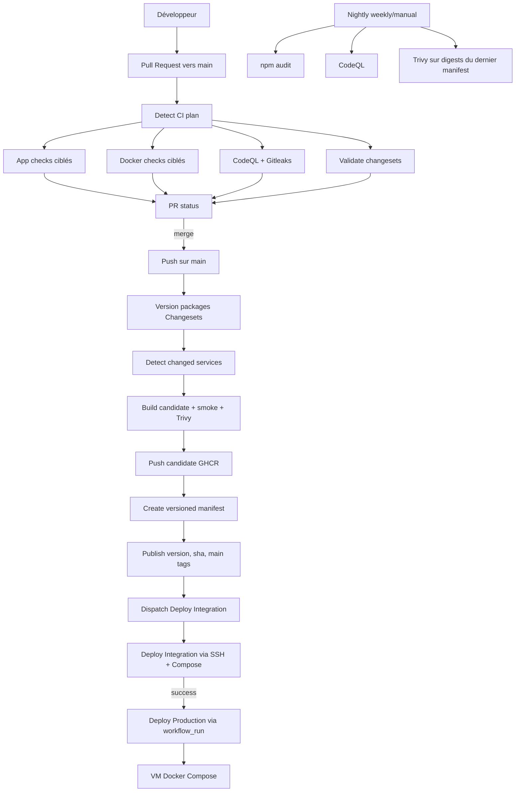

# CI/CD, versions et livraison

Dernière mise à jour: 29 juin 2026.

Ce document décrit l'état actuel de la chaîne GitHub Actions: validation Pull Request, versionnement Changesets, publication d'images GHCR, manifests de déploiement et déploiement Compose sur VM.

## 1. Vue d'ensemble

Le dépôt utilise une stratégie GitHub Flow:

- les changements applicatifs passent par une Pull Request vers `main`;
- les PR sont validées par un plan CI calculé à partir des fichiers modifiés;
- les versions sont déclarées par Changesets;
- après merge dans `main`, les packages versionnés produisent des images GHCR candidates;
- seules les images vérifiées sont poussées et inscrites dans un manifest versionné;
- les déploiements integration et production utilisent les digests du manifest, sans rebuild.

Les services runtime livrés sont:

| Service                | Package                     | Image GHCR             |
| ---------------------- | --------------------------- | ---------------------- |
| `auth-service`         | `@app/auth-service`         | `auth-service`         |
| `project-service`      | `@app/project-service`      | `project-service`      |
| `task-service`         | `@app/task-service`         | `task-service`         |
| `notification-service` | `@app/notification-service` | `notification-service` |
| `gateway`              | `@app/gateway`              | `gateway`              |
| `client`               | `client`                    | `client`               |

`@app/common` est un package backend partagé. Il n'a pas d'image runtime, mais ses changements peuvent forcer un bump patch des services backend qui en dépendent.

## 2. Schéma Mermaid



## 3. Pull Request vers `main`

Workflow principal: `.github/workflows/pr_main.yml`.

Déclencheur:

- `pull_request` vers `main`;
- sauf branche technique `changesets/version-packages`, qui est traitée à part.

Étapes:

| Job             | Rôle                                                                        |
| --------------- | --------------------------------------------------------------------------- |
| `changes`       | appelle `.github/actions/detect-ci-plan` et calcule les checks nécessaires  |
| `app-checks`    | lance les validations backend/client/manifests selon le plan                |
| `docker-checks` | valide Compose, lint les Dockerfiles et build les images touchées sans push |
| `security`      | lance CodeQL et Gitleaks                                                    |
| `pr-status`     | échoue si un job requis a échoué ou a été annulé                            |

Le plan CI est produit par `.github/scripts/ci-plan.mjs`. Il classe les fichiers modifiés en scopes:

- backend quality;
- backend integration/e2e;
- backend license;
- client quality;
- client e2e;
- client license;
- Docker Compose;
- Docker service images;
- manifests de déploiement;
- packages qui doivent avoir un Changeset.

## 4. Checks applicatifs

Reusable workflow: `.github/workflows/_pr-app-checks.yml`.

Backend:

- `npm run lint`;
- `npm run build`;
- tests unitaires avec coverage;
- license check;
- tests integration avec `make ci-backend-integration`;
- tests e2e avec `make ci-backend-e2e`;
- artefacts de résultats et coverage.

Client:

- `npm run lint`;
- `npm run build`;
- license check;
- Playwright e2e avec `make ci-frontend-e2e`;
- artefacts Playwright.

Manifests:

- tests des scripts manifest et compatibility;
- validation de `deploy/manifests/integration.yaml`;
- validation de la compatibilité API via `deploy/compatibility.yaml`.

## 5. Checks Docker en PR

Reusable workflow: `.github/workflows/_pr-docker-checks.yml`.

Quand `compose.yaml` ou `compose.prod.yml` change, le job `compose` exécute:

```bash
docker compose config --quiet
```

Quand un service runtime ou son Dockerfile change, le job `services`:

- lint le Dockerfile avec Hadolint;
- build l'image avec `.github/actions/build-service-image`;
- ne pousse pas l'image.

Le build utilise Buildx, cible `linux/amd64`, labels OCI et cache Docker registry quand le contexte le permet.

## 6. Sécurité automatisée

PR:

- CodeQL JavaScript/TypeScript;
- Gitleaks avec upload SARIF.

Nightly:

- CodeQL planifié;
- `npm audit --audit-level=high` sur `server` et `client`;
- Trivy sur les images du dernier manifest versionné.

Le workflow nightly est planifié le mardi à `03:30` UTC et peut aussi être lancé manuellement.

## 7. Changesets et versionnement

Deux contextes Changesets existent:

| Contexte | Dossier             | Commande                            | Packages         |
| -------- | ------------------- | ----------------------------------- | ---------------- |
| Backend  | `server/.changeset` | `npm --prefix server run changeset` | `@app/*` backend |
| Client   | `client/.changeset` | `npm --prefix client run changeset` | `client`         |

Raccourci Makefile:

```bash
make verup server
make verup client
```

Règles:

- les versions des services backend sont indépendantes;
- il n'y a pas de groupe fixed ou linked;
- un changement runtime d'un service doit sélectionner le package de ce service;
- un changement de `server/common/**` doit sélectionner `@app/common` et les services affectés si leur contrat/runtime change;
- un changement runtime client doit ajouter un Changeset dans `client/.changeset`;
- les changements uniquement documentation ne nécessitent pas de bump applicatif.

La validation est faite par `.github/actions/validate-changesets`, qui lit le plan CI et vérifie que les packages requis sont couverts.

## 8. Merge dans `main`

Workflow principal: `.github/workflows/pre_push_main.yml`.

Le workflow est ignoré pour:

- Dependabot;
- commits contenant `[skip ci]`.

Étapes:

1. `version-packages`
   Applique les Changesets avec `changeset version`, met à jour `package.json`, lockfiles et changelogs, puis commit directement sur `main` avec `[skip ci]` si un diff est produit.

2. `plan`
   Recalcule les services à publier à partir des `package.json` modifiés.

3. `verify-images`
   Build chaque image candidate localement avec le tag `candidate-<run_id>-<sha>`, lance Hadolint, un smoke test et Trivy.

4. `push-images`
   Télécharge l'image candidate vérifiée, la pousse dans GHCR et produit un artifact `release-metadata-<service>-<sha>`.

5. `update-integration`
   Crée un nouveau manifest versionné `deploy/manifests/manifest-x.y.z.yaml` à partir des metadata et du dernier manifest existant.

6. `finalize-image-tags`
   Ajoute les tags finaux `:<version>`, `:sha-<sourceRevision>` et `:main` sur le digest déjà inscrit dans le manifest.

7. `dispatch-integration-deploy`
   Déclenche `deploy-integration.yml` avec la version du manifest publiée.

## 9. Images GHCR

Pendant la vérification, une image candidate est construite avec un tag temporaire:

```text
ghcr.io/<owner>/<repo>/<service>:candidate-<run_id>-<sourceRevision>
```

Après publication du manifest, le même digest reçoit:

```text
ghcr.io/<owner>/<repo>/<service>:<package-version>
ghcr.io/<owner>/<repo>/<service>:sha-<sourceRevision>
ghcr.io/<owner>/<repo>/<service>:main
```

La référence réellement déployée reste toujours le digest:

```text
ghcr.io/<owner>/<repo>/<service>@sha256:<digest>
```

Ne pas déployer un tag candidat qui n'apparaît pas dans un manifest validé.

## 10. Manifests de déploiement

Les manifests sont dans `deploy/manifests`.

| Fichier               | Rôle                                                           |
| --------------------- | -------------------------------------------------------------- |
| `schema.json`         | schéma JSON des manifests                                      |
| `integration.yaml`    | manifest bootstrap utilisé par certains tests de compatibilité |
| `manifest-x.y.z.yaml` | manifests versionnés créés par le workflow main                |

Un manifest contient:

- `schemaVersion: 1`;
- `manifestVersion`;
- les six services runtime;
- pour chaque service: `version`, `sourceRevision`, `image`.

Les images doivent être des références GHCR avec digest `@sha256`. Les tags `latest` ne sont pas autorisés.

Commandes utiles:

```bash
node .github/scripts/manifest.mjs latest
node .github/scripts/manifest.mjs validate deploy/manifests/manifest-0.0.5.yaml
node .github/scripts/manifest.mjs list-images --manifest deploy/manifests/manifest-0.0.5.yaml
node .github/scripts/manifest.mjs validate-compose \
  --manifest deploy/manifests/manifest-0.0.5.yaml \
  --output /tmp/images.env
```

## 11. Compatibilité API

Le fichier `deploy/compatibility.yaml` exprime les contrats API fournis, exposés et consommés.

Le contrôle actuel couvre `authApi`:

- `auth-service` fournit `legacy`, `v1` et `v2` selon sa version;
- `gateway` expose les routes compatibles;
- `client` consomme `legacy` avant `0.1.0`, puis `v2` à partir de `0.1.0`.

Validation:

```bash
node .github/scripts/compatibility.mjs validate \
  --manifest deploy/manifests/manifest-0.0.5.yaml \
  --matrix deploy/compatibility.yaml
```

## 12. Déploiement integration

Workflow: `.github/workflows/deploy-integration.yml`.

Déclencheurs:

- manuel (`workflow_dispatch`);
- automatique après publication d'un manifest par `pre_push_main.yml`.

Le workflow appelle `.github/workflows/_deploy-compose.yml` avec:

- `deployment_name: todo-integration`;
- `environment_name: integration`;
- chemin par défaut `/opt/projet-archi-to-do-list-integration`;
- override `VITE_API_VERSION=${{ vars.VITE_API_VERSION_INTEGRATION }}`.

Secrets requis:

- `VM_HOST_INT`;
- `VM_USER_INT`;
- `SSH_PRIVATE_KEY_INT`.

## 13. Déploiement production

Workflow: `.github/workflows/release.yml`.

Déclencheurs:

- manuel (`workflow_dispatch`);
- automatique quand `Deploy Integration` se termine avec succès sur `main`.

Le workflow appelle le même reusable `_deploy-compose.yml` avec:

- `deployment_name: todo-production`;
- `environment_name: production`;
- chemin par défaut `/opt/projet-archi-to-do-list-production`.

Secrets requis:

- `VM_HOST_PROD`;
- `VM_USER_PROD`;
- `SSH_PRIVATE_KEY_PROD`.

Production déploie le manifest demandé en input ou, par défaut, le dernier manifest versionné.

## 14. Déploiement Compose sur VM

Reusable workflow: `.github/workflows/_deploy-compose.yml`.

Étapes principales:

1. validation des inputs;
2. checkout de la source de déploiement de confiance (`main` par défaut);
3. résolution du manifest;
4. validation manifest + compatibilité;
5. rendu d'un `compose.yml` depuis `compose.prod.yml`;
6. vérification que le compose rendu correspond au manifest;
7. copie d'un bundle sur la VM;
8. exécution de `.github/scripts/deploy/remote-compose-up.sh`.

Le script distant:

- exige Docker et le plugin Docker Compose;
- lit ou crée les chemins partagés `shared/server.env.docker` et `shared/compose.env`;
- applique les overrides éventuels de `compose.env`;
- copie `compose.yml`, `client/nginx.conf` et `manifest.yaml` dans `app`;
- se connecte à GHCR;
- exécute `docker compose config --quiet`;
- exécute `docker compose pull`;
- exécute `docker compose up -d --wait --remove-orphans` si l'option `--wait` est disponible;
- affiche `docker compose ps`.

La VM doit donc contenir avant le premier déploiement:

```text
<DEPLOY_PATH>/shared/server.env.docker
<DEPLOY_PATH>/shared/compose.env
```

`server.env.docker` contient la configuration backend/secrets. `compose.env` contient les ports publiés et les variables Compose comme `VITE_API_VERSION`.

## 15. `compose.prod.yml`

`compose.prod.yml` ne build pas les services applicatifs. Il attend des images immuables:

| Variable                     | Service                                        |
| ---------------------------- | ---------------------------------------------- |
| `AUTH_SERVICE_IMAGE`         | `auth-service` et `auth-service-migrate`       |
| `PROJECT_SERVICE_IMAGE`      | `project-service` et `project-service-migrate` |
| `TASK_SERVICE_IMAGE`         | `task-service` et `task-service-migrate`       |
| `NOTIFICATION_SERVICE_IMAGE` | `notification-service`                         |
| `GATEWAY_IMAGE`              | `gateway`                                      |
| `CLIENT_IMAGE`               | `client`                                       |

Les services `*-migrate` sont des one-shot containers qui lancent les migrations MySQL avant le démarrage des services correspondants.

Ports publiés configurables:

| Variable                      | Défaut |
| ----------------------------- | -----: |
| `MYSQL_PORT_PUBLISHED`        | `3306` |
| `REDIS_PORT_PUBLISHED`        | `6379` |
| `MAILPIT_UI_PORT_PUBLISHED`   | `8025` |
| `MAILPIT_SMTP_PORT_PUBLISHED` | `1025` |
| `GATEWAY_PORT_PUBLISHED`      | `3000` |
| `CLIENT_PORT_PUBLISHED`       |   `80` |

## 16. Mettre à jour une version de microservice

Procédure standard:

1. Modifier le code et les tests.
2. Lancer les checks locaux adaptés, par exemple:

```bash
make test-backend
make test-frontend
```

3. Créer le Changeset:

```bash
make verup server
```

ou:

```bash
make verup client
```

4. Sélectionner seulement les packages réellement concernés.
5. Choisir `patch`, `minor` ou `major`.
6. Écrire une note de release claire.
7. Ouvrir la PR.
8. Attendre les checks PR.
9. Merger dans `main`.

Après merge, le workflow main:

- applique le bump;
- publie les images des packages dont le `package.json` a changé;
- crée un manifest versionné;
- déclenche le déploiement integration.

## 17. Choisir `patch`, `minor` ou `major`

| Type    | Quand l'utiliser                                                                                                |
| ------- | --------------------------------------------------------------------------------------------------------------- |
| `patch` | bugfix compatible, refactor sans changement de contrat, correction Docker/runtime                               |
| `minor` | nouvelle fonctionnalité compatible, nouveau champ optionnel, nouvelle route versionnée                          |
| `major` | changement incompatible de contrat, suppression de route/champ, migration irréversible nécessitant coordination |

Pour un changement de contrat partagé:

- versionner le provider (`auth-service`, `project-service`, etc.);
- versionner le consumer si son comportement change (`client`, `gateway`);
- mettre à jour `deploy/compatibility.yaml` si une nouvelle compatibilité de versions est introduite;
- vérifier les OpenAPI ou routes que le sanity check attend.

## 18. Rollback

Le rollback applicatif se fait par manifest:

1. identifier un ancien `deploy/manifests/manifest-x.y.z.yaml`;
2. relancer `deploy-integration.yml` ou `release.yml` avec `manifest_version`;
3. vérifier `docker compose ps` et les logs sur la VM.

Un rollback d'image ne garantit pas le rollback de données. Les migrations `down` existent pour les services MySQL, mais elles peuvent être destructrices selon la migration. Ne pas lancer un rollback de schéma sans vérifier le contenu de la migration.

## 19. Secrets et variables GitHub

Secrets/variables attendus par les workflows:

| Nom                                                    | Usage                                                          |
| ------------------------------------------------------ | -------------------------------------------------------------- |
| `CD_APP_PRIVATE_KEY`                                   | token GitHub App pour commits automatiques de version/manifest |
| `CD_APP_CLIENT_ID`                                     | variable GitHub App associée au token                          |
| `VM_HOST_INT`, `VM_USER_INT`, `SSH_PRIVATE_KEY_INT`    | accès VM integration                                           |
| `VM_HOST_PROD`, `VM_USER_PROD`, `SSH_PRIVATE_KEY_PROD` | accès VM production                                            |
| `VITE_API_VERSION_INTEGRATION`                         | version d'API auth/users exposée au client integration         |

Les secrets runtime de l'application ne doivent pas être stockés dans les manifests. Ils vivent dans `server.env.docker` sur la VM ou dans le gestionnaire de secrets de l'environnement cible.
