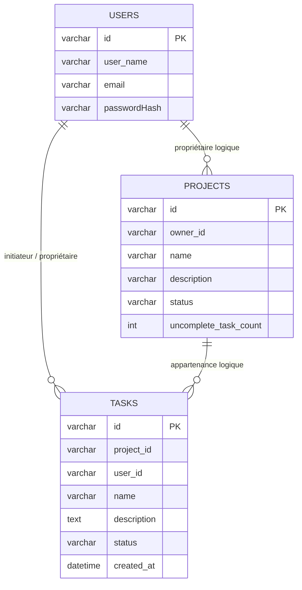

# Base de données et stratégie de stockage

## 1. Stratégie générale de stockage

Le projet utilise une persistance multi-driver. Le même ensemble de use cases fonctionne au-dessus de trois variantes de stockage :

| Driver   | Où il est utilisé                        | Usage                                           |
| -------- | ---------------------------------------- | ----------------------------------------------- |
| `memory` | scénarios backend unit/e2e, tests isolés | tests rapides sans base externe                 |
| `sqlite` | mode local allégé                        | exécution locale simple sans MySQL              |
| `mysql`  | mode principal dev/docker                | stockage plus réaliste et meilleure intégration |

Le choix du driver se fait via la variable d'environnement `DB_DRIVER`.

## 2. Modèle de propriété des données

Physiquement, dans Docker, tous les services utilisent une seule instance MySQL, mais logiquement les données sont séparées par bounded context :

- `auth-service` possède la table `users` ;
- `project-service` possède la table `projects` ;
- `task-service` possède la table `tasks`.

Les services ne font pas de jointures SQL entre leurs contextes. La coordination de l'état se fait via :

- HTTP ;
- événements BullMQ ;
- request/reply via Redis.

## 3. Schéma logique

Important : dans l'implémentation actuelle, les relations entre services sont logiques et non matérialisées par des contraintes de foreign key interservices.

## 4. Tables par service

### 4.1 `auth-service` -> `users`

Le schéma MySQL et SQLite est identique :

| Colonne        | Type           | Contraintes                                |
| -------------- | -------------- | ------------------------------------------ |
| `id`           | `varchar(36)`  | `PRIMARY KEY`                              |
| `user_name`    | `varchar(255)` | `UNIQUE`                                   |
| `passwordHash` | `varchar(255)` | sans validation `NULL` au niveau du schéma |
| `email`        | `varchar(255)` | `UNIQUE`                                   |

Ce qui est stocké :

- l'identifiant utilisateur ;
- le login ;
- l'e-mail ;
- le hash bcrypt du mot de passe.

### 4.2 `project-service` -> `projects`

#### SQLite

| Colonne                 | Type           | Signification             |
| ----------------------- | -------------- | ------------------------- |
| `id`                    | `varchar(36)`  | identifiant du projet     |
| `name`                  | `varchar(255)` | nom du projet             |
| `description`           | `varchar(255)` | description               |
| `status`                | `varchar(10)`  | `OPEN` / `CLOSED`         |
| `uncomplete_task_count` | `integer`      | nombre de tâches ouvertes |
| `owner_id`              | `varchar(36)`  | propriétaire              |

#### MySQL

| Colonne                 | Type           | Signification                                   |
| ----------------------- | -------------- | ----------------------------------------------- |
| `id`                    | `varchar(36)`  | identifiant du projet                           |
| `name`                  | `varchar(255)` | nom du projet                                   |
| `description`           | `varchar(255)` | description                                     |
| `status`                | `varchar(10)`  | `OPEN` / `CLOSED`                               |
| `uncomplete_task_count` | `INT`          | nombre de tâches ouvertes                       |
| `tasks`                 | `TEXT`         | colonne legacy, plus utilisée par l'application |
| `owner_id`              | `varchar(36)`  | propriétaire                                    |

`openTaskCount` est mis à jour non pas par des commandes HTTP directes, mais via le traitement des événements `task.created`, `task.closed`, `task.reopened`, `task.deleted`.

### 4.3 `task-service` -> `tasks`

| Colonne       | Type                       | Signification           |
| ------------- | -------------------------- | ----------------------- |
| `id`          | `varchar(36)`              | identifiant de la tâche |
| `name`        | `varchar(255)`             | nom de la tâche         |
| `description` | `text` / `TEXT`            | description             |
| `status`      | `varchar(16)`              | `OPEN` / `DONE`         |
| `created_at`  | `datetime` / `DATETIME(3)` | date de création        |
| `user_id`     | `varchar(36)`              | initiateur              |
| `project_id`  | `varchar(36)`              | projet                  |

Les tâches sont toujours triées par `created_at ASC` lors de la lecture du détail d'un projet.

## 5. Comment et quand les tables sont créées

Pour tous les drivers, le schéma est initialisé lors de `connection.init()` :

- pour `mysql`, la connexion attend l'ouverture du port puis exécute `CREATE TABLE IF NOT EXISTS` ;
- pour `sqlite`, le fichier de base est ouvert puis `CREATE TABLE IF NOT EXISTS` est exécuté ;
- pour `memory`, des tables in-memory sont créées dans la représentation runtime.

Le projet n'a pas de système de migrations séparé. Le schéma évolue directement dans le code des drivers.

Important : lors d'un changement de schéma MySQL, il faut supprimer manuellement l'ancienne table ou utiliser `ALTER TABLE` pour conserver les données. Pour `sqlite`, il suffit de supprimer le fichier de base.

## 6. Repositories et leur contrat

Chaque service encapsule l'accès aux données via une interface de repository.

### Auth

- `UserRepository.getUsers()`
- `UserRepository.getUserById(id)`
- `UserRepository.getUserByName(name)`
- `UserRepository.createUser(user)`
- `UserRepository.updateUsername(id, username)`
- `UserRepository.changeUserPassword(id, passwordHash)`
- `UserRepository.deleteUser(id)`

### Projects

- `ProjectRepository.findById(id)`
- `ProjectRepository.findByOwnerId(ownerId)`
- `ProjectRepository.save(project)`
- `ProjectRepository.delete(projectId)`

### Tasks

- `TaskRepository.findById(id)`
- `TaskRepository.findByProjectId(projectId)`
- `TaskRepository.save(task)`
- `TaskRepository.delete(taskId)`

Cela permet de changer de storage driver sans modifier la couche application/domain.

## 7. Comportement selon l'environnement

### `memory`

- ne nécessite pas de base externe ;
- très rapide ;
- idéal pour les tests unitaires et une partie des backend e2e ;
- les données disparaissent à la fin du processus.

### `sqlite`

- utilise le fichier `SQLITE_DB_LOCATION` ;
- pratique pour un développement local autonome ;
- tous les services lisent la même clé d'environnement `SQLITE_DB_LOCATION`.

### `mysql`

- mode principal dans `server/.env` et `server/.env.docker` ;
- utilisé avec un pool `mysql2` ;
- attend le port `3306` avant l'initialisation ;
- adapté au mode local avec Docker infra et au Docker Compose complet.

## 8. Ce qui n'est pas stocké en base

Toutes les données ne sont pas persistées côté backend :

- l'historique des notifications et le compteur non lu sont stockés dans le `localStorage` du navigateur ;
- les connexions SSE actives sont conservées en mémoire dans `notification-service` ;
- les files et messages vivent dans Redis/BullMQ, pas dans MySQL.

## 9. Limitations du modèle de stockage actuel

- il n'existe pas de système de migration explicite ;
- dans le schéma MySQL `projects`, une colonne legacy `tasks` n'est plus utilisée par l'application ;
- les liens logiques entre `users`, `projects`, `tasks` ne sont pas garantis par des clés étrangères entre bounded contexts ;
- les schémas `sqlite` et `mysql` sont proches, mais pas totalement identiques.

La liste détaillée des problèmes et le plan de correction se trouvent dans [known-issues](known-issues.md).
