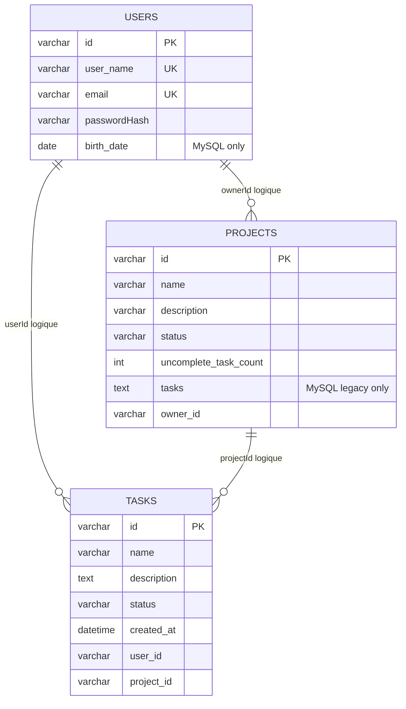

# Base de données et stratégie de stockage

## 1. Vue d'ensemble

Le backend utilise une stratégie de persistance multi-driver. Les services `auth-service`, `project-service` et `task-service` accèdent aux données via des interfaces de repository et choisissent leur driver avec `DB_DRIVER`.

Drivers supportés:

| Driver   | Usage principal                     | Dépendance externe | Persistance                   |
| -------- | ----------------------------------- | ------------------ | ----------------------------- |
| `memory` | tests unitaires et scénarios isolés | aucune             | non, état perdu à l'arrêt     |
| `sqlite` | développement local léger           | fichier SQLite     | oui, via `SQLITE_DB_LOCATION` |
| `mysql`  | mode principal local/Docker         | MySQL 8            | oui                           |

Le service `notification-service` ne possède pas encore de table de notifications. Il garde les connexions SSE en mémoire et le client stocke l'historique dans `localStorage`.

## 2. Propriété logique des données

Même si le mode Docker utilise une seule instance MySQL, les services possèdent leurs données par bounded context:

| Service           | Table      | Responsabilité                                 |
| ----------------- | ---------- | ---------------------------------------------- |
| `auth-service`    | `users`    | identité utilisateur et hash de mot de passe   |
| `project-service` | `projects` | projets, statut et compteur de tâches ouvertes |
| `task-service`    | `tasks`    | tâches et statut `OPEN`/`DONE`                 |

Les services ne font pas de jointures SQL interservices. Les relations sont logiques et maintenues par:

- JWT et `userId`;
- commandes/événements BullMQ;
- request/reply `task.list.requested` / `task.list.replied`;
- projection `openTaskCount`.

## 3. Schéma logique



Les clés étrangères ne sont pas matérialisées dans les schémas actuels.

## 4. Initialisation des drivers et migrations

Chaque service construit un container de persistance au démarrage:

1. lecture de `DB_DRIVER`;
2. sélection d'une factory `memory`, `sqlite` ou `mysql`;
3. création d'une connexion;
4. appel à `connection.init()`;
5. application des migrations ou du schéma local selon le driver;
6. création du repository;
7. injection dans la couche application.

### MySQL

MySQL utilise Umzug via `server/common/persistence/migrations/*`.

Chaque connexion MySQL:

- attend le port MySQL;
- crée un pool `mysql2`;
- vérifie `SELECT 1` avec retries;
- applique les migrations du service avec `migrator.up()`;
- stocke l'historique dans la table `schema_migrations`.

Les services `auth-service`, `project-service` et `task-service` ont aussi des scripts explicites:

```bash
npm --prefix server run migrate:up -w @app/auth-service
npm --prefix server run migrate:down -w @app/auth-service
npm --prefix server run migrate:up -w @app/project-service
npm --prefix server run migrate:up -w @app/task-service
```

En production Compose, les services `auth-service-migrate`, `project-service-migrate` et `task-service-migrate` exécutent les migrations avant de démarrer les services applicatifs.

### SQLite et memory

SQLite reste initialisé par les fichiers `schema.ts` des drivers. Le driver `memory` simule les tables avec des collections en mémoire.

## 5. Variables de configuration

| Variable              | Usage                                                                 |
| --------------------- | --------------------------------------------------------------------- |
| `DB_DRIVER`           | `memory`, `sqlite` ou `mysql`                                         |
| `SQLITE_DB_LOCATION`  | chemin du fichier SQLite                                              |
| `MYSQL_HOST`          | hôte MySQL, `localhost` ou `db`                                       |
| `MYSQL_PORT`          | port MySQL, `3306` par défaut                                         |
| `MYSQL_USER`          | utilisateur MySQL                                                     |
| `MYSQL_PASSWORD`      | mot de passe applicatif recommandé et mot de passe du conteneur MySQL |
| `MYSQL_ROOT_PASSWORD` | fallback historique si `MYSQL_PASSWORD` n'est pas défini              |
| `MYSQL_DATABASE`      | base utilisée par les services                                        |
| `MYSQL_HOST_FILE`     | secret file optionnel pour l'hôte                                     |
| `MYSQL_USER_FILE`     | secret file optionnel pour l'utilisateur                              |
| `MYSQL_PASSWORD_FILE` | secret file optionnel pour le mot de passe                            |
| `MYSQL_DB_FILE`       | secret file optionnel pour le nom de base                             |

Point d'attention: les factories MySQL utilisent `MYSQL_PASSWORD` puis retombent sur `MYSQL_ROOT_PASSWORD` pour compatibilité. En environnement partagé, utiliser un utilisateur applicatif à privilèges limités et éviter de dépendre du fallback root.

## 6. Table `users`

Fichiers:

- `server/apps/auth-service/src/migrations/0001-create-users-table.ts`;
- `server/apps/auth-service/src/migrations/0002-add-birth-date-to-users.ts`;
- `server/apps/auth-service/src/infrastructure/persistence/sqlite/schema.ts`.

Schéma MySQL:

```sql
CREATE TABLE IF NOT EXISTS users
(
    id varchar(36) PRIMARY KEY,
    user_name varchar(255) UNIQUE,
    passwordHash varchar(255),
    email varchar(255) UNIQUE,
    birth_date DATE NULL
)
```

SQLite utilise le même schéma sans `birth_date`; le repository SQLite retourne donc `birthDate: null`.

### Colonnes

| Colonne        | Type           | Rôle                                                    |
| -------------- | -------------- | ------------------------------------------------------- |
| `id`           | `varchar(36)`  | identifiant UUID                                        |
| `user_name`    | `varchar(255)` | username unique                                         |
| `passwordHash` | `varchar(255)` | hash bcrypt                                             |
| `email`        | `varchar(255)` | e-mail unique                                           |
| `birth_date`   | `DATE NULL`    | date de naissance exposée par l'API v2, MySQL seulement |

### Repository

Interface: `server/apps/auth-service/src/domain/repositories/UserRepository.ts`.

Méthodes:

- `getUsers()`;
- `getUserById(id)`;
- `getUserByName(name)`;
- `createUser(user)`;
- `updateUsername(id, username)`;
- `changeUserPassword(id, passwordHash)`;
- `deleteUser(id)`.

## 7. Table `projects`

Fichiers:

- `server/apps/project-service/src/migrations/0001-create-projects-table.ts`;
- `server/apps/project-service/src/infrastructure/persistence/sqlite/schema.ts`.

### MySQL

```sql
CREATE TABLE IF NOT EXISTS projects
(
    id varchar(36) PRIMARY KEY,
    name varchar(255),
    description varchar(255),
    status varchar(10),
    uncomplete_task_count INT DEFAULT 0,
    tasks TEXT,
    owner_id varchar(36)
)
```

### SQLite

```sql
CREATE TABLE IF NOT EXISTS projects
(
    id varchar(36) PRIMARY KEY,
    name varchar(255),
    description varchar(255),
    status varchar(10),
    uncomplete_task_count integer DEFAULT 0,
    owner_id varchar(36)
)
```

### Colonnes

| Colonne                 | Type              | Rôle                                       |
| ----------------------- | ----------------- | ------------------------------------------ |
| `id`                    | `varchar(36)`     | identifiant UUID du projet                 |
| `name`                  | `varchar(255)`    | nom du projet                              |
| `description`           | `varchar(255)`    | description du projet                      |
| `status`                | `varchar(10)`     | `OPEN` ou `CLOSED`                         |
| `uncomplete_task_count` | `INT` / `integer` | projection du nombre de tâches ouvertes    |
| `tasks`                 | `TEXT`            | colonne legacy présente seulement en MySQL |
| `owner_id`              | `varchar(36)`     | propriétaire logique                       |

### Mapping domaine

| Base                    | Domaine/API       |
| ----------------------- | ----------------- |
| `owner_id`              | `ownerId`         |
| `uncomplete_task_count` | `openTaskCount`   |
| `status`                | `OPEN` / `CLOSED` |

`openTaskCount` est mis à jour par les événements de tâches, pas par calcul SQL:

- `task.created` incrémente;
- `task.closed` décrémente;
- `task.reopened` incrémente;
- `task.deleted` décrémente seulement si `previousStatus` vaut `OPEN`.

### Repository

Interface: `server/apps/project-service/src/domain/repositories/ProjectRepository.ts`.

Méthodes:

- `findById(id)`;
- `findByOwnerId(ownerId)`;
- `save(project)`;
- `delete(projectId)`.

## 8. Table `tasks`

Fichiers:

- `server/apps/task-service/src/migrations/0001-create-tasks-table.ts`;
- `server/apps/task-service/src/infrastructure/persistence/sqlite/schema.ts`.

### MySQL

```sql
CREATE TABLE IF NOT EXISTS tasks
(
    id varchar(36) PRIMARY KEY,
    name varchar(255),
    description TEXT,
    status varchar(16),
    created_at DATETIME(3) NOT NULL,
    user_id varchar(36),
    project_id varchar(36)
)
```

### SQLite

```sql
CREATE TABLE IF NOT EXISTS tasks
(
    id varchar(36) PRIMARY KEY,
    name varchar(255),
    description text,
    status varchar(16),
    created_at datetime,
    user_id varchar(36),
    project_id varchar(36)
)
```

### Colonnes

| Colonne       | Type                       | Rôle                      |
| ------------- | -------------------------- | ------------------------- |
| `id`          | `varchar(36)`              | identifiant UUID de tâche |
| `name`        | `varchar(255)`             | nom de tâche              |
| `description` | `TEXT` / `text`            | description               |
| `status`      | `varchar(16)`              | `OPEN` ou `DONE`          |
| `created_at`  | `DATETIME(3)` / `datetime` | date de création          |
| `user_id`     | `varchar(36)`              | utilisateur initiateur    |
| `project_id`  | `varchar(36)`              | projet logique            |

### Mapping domaine

| Base         | Domaine/API |
| ------------ | ----------- |
| `created_at` | `createdAt` |
| `user_id`    | `userId`    |
| `project_id` | `projectId` |

La création d'une tâche normalise `createdAt` à la minute UTC. Les lectures de détail projet retournent `createdAt` au format ISO.

### Repository

Interface: `server/apps/task-service/src/domain/repositories/TaskRepository.ts`.

Méthodes:

- `findById(id)`;
- `findByProjectId(projectId)`;
- `save(task)`;
- `delete(taskId)`.

Les tâches sont lues par projet pour construire `ProjectDetailsDto`.

## 9. Comportement par driver

### `memory`

Caractéristiques:

- aucune dépendance externe;
- utile pour les tests unitaires;
- état perdu à l'arrêt du processus;
- schéma simulé par des collections en mémoire.

Limites:

- ne permet pas de tester les contraintes SQL;
- ne représente pas le comportement de concurrence d'une vraie base.

### `sqlite`

Caractéristiques:

- fichier défini par `SQLITE_DB_LOCATION`;
- pratique pour un développement local simple;
- schémas proches de MySQL;
- aucune dépendance serveur externe.

Limites:

- pas identique à MySQL sur les types et certains comportements;
- pas de migrations Umzug appliquées;
- `users.birth_date` n'est pas matérialisé dans le schéma SQLite actuel;
- si le schéma évolue fortement, il peut être nécessaire de supprimer le fichier local.

### `mysql`

Caractéristiques:

- mode principal dans `compose.yaml`;
- image `mysql:8`;
- volume Compose `db_data`;
- pool `mysql2`;
- attente du port avant initialisation;
- migrations Umzug appliquées au démarrage et via scripts `migrate:up/down`.

Limites:

- une seule base physique pour plusieurs bounded contexts;
- fallback historique sur `MYSQL_ROOT_PASSWORD` si `MYSQL_PASSWORD` manque;
- colonne legacy `projects.tasks`.

## 10. Données non persistées en base

| Donnée                                   | Où elle vit actuellement          | Conséquence                                   |
| ---------------------------------------- | --------------------------------- | --------------------------------------------- |
| connexions SSE actives                   | mémoire de `notification-service` | perdues au redémarrage                        |
| historique des notifications             | `localStorage` navigateur         | non partagé entre appareils                   |
| compteur non lu                          | `localStorage` navigateur         | non fiable comme source serveur               |
| messages BullMQ                          | Redis                             | dépend de la configuration Redis et de BullMQ |
| opérations asynchrones par `operationId` | non persistées                    | pas de suivi public d'état                    |

## 11. Cohérence et intégrité

Le modèle actuel privilégie la séparation pédagogique des responsabilités:

- pas de clés étrangères interservices;
- pas de transaction distribuée;
- pas de cascade SQL entre projet et tâches;
- compteur `openTaskCount` mis à jour par événements;
- détails projet reconstruits par request/reply.

Conséquences:

- une commande de tâche peut être acceptée avant que la vue ne reflète le résultat;
- si Redis ou un worker est indisponible, la projection peut prendre du retard;
- les suppressions de projet et tâches doivent être renforcées si une garantie de nettoyage complet est requise.

## 12. Recommandations d'évolution

Avant une exploitation plus sérieuse, il faudrait:

- étendre ou aligner la stratégie de migrations pour SQLite;
- supprimer le fallback `MYSQL_ROOT_PASSWORD` après migration des environnements;
- supprimer ou migrer la colonne legacy `projects.tasks`;
- ajouter des contraintes `NOT NULL` là où le domaine les impose;
- décider si les relations logiques doivent rester sans foreign keys ou être matérialisées dans certains environnements;
- persister les notifications côté backend;
- ajouter un suivi d'opération asynchrone par `operationId`.
